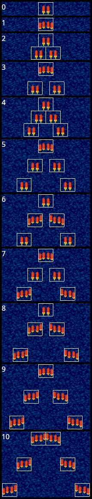

# Damage scaling in Twin Cobra (Sega Genesis)

## Player damage output

The player can upgrade his weapon up to 10 times. The weapon type is held in a byte at RAM address 0xB2B7 and the weapon level is the next byte at 0xB2B8, with valid values ranging from 0 to 10.\
Here is a picture showing the different levels for the red weapon:

We can see that there are two kinds of projectiles, one showing two rockets (1 damage value) and the other shows four (2 damage value). A table that maps projectiles to damage is at ROM:0x21608. Specifically, those red projectiles are at 0x2160D and 0x2160F.

Weapon level 0 deals 1 damage per shot (DPS), and each level adds 1 DPS or 2, up to 12 DPS for the max level. The other weapon types follow a similar pattern.

In short, a maxed-out weapon potentially deals 12x the damage of the base.

## Enemy health scaling

Enemy hit-points vary based on the player's weapon level.
The relevant table is ROM:0x22C86.

It looks like this:

Some individual entries (indices above 10 can be disregarded):

The general trend is a for enemies to spawn with up to ~3x their base hit-points value in proportion to the player's weapon level.
The "zako" helicopters are one exception, always remaining at 1.

The stage 1 boss has a base health of 128 hit-points, so you need to shoot it 128 times with the base weapon.
Were you able to arrive there with a maxed-out weapon, it would take ~11 shots to defeat, but scaling bumps it to 32.

In the end, this scaling provides a way to taper the player's effective damage output. Weapon level 10 is only really 4x as powerful as level 0, despite the bullets totaling 12x more damage.